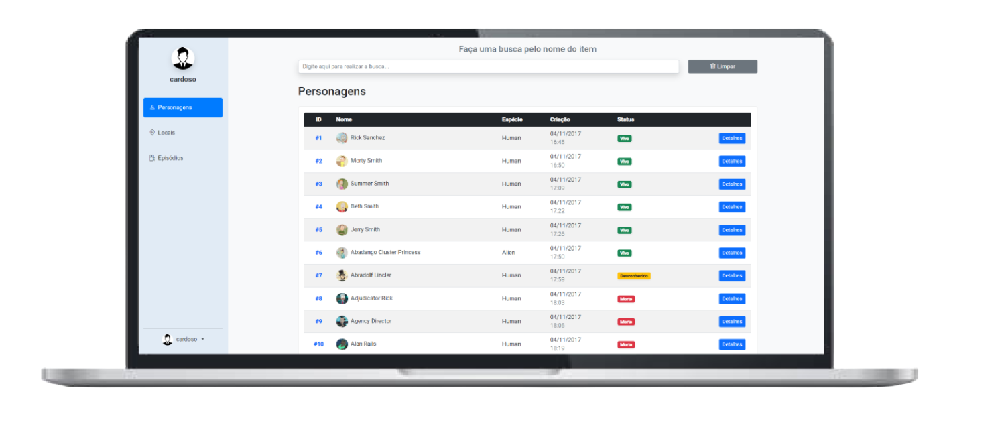

<h1 align="center">
  Kogui Challenge
</h1>

  

## ✨ Tecnologias

Esse projeto foi desenvolvido com as seguintes tecnologias:

- [Angular](https://angular.dev)
- [Bootstrap v5.0](https://getbootstrap.com/docs/5.0/getting-started/introduction/)
- [TypeScript](https://www.typescriptlang.org)

## 💻 Projeto

O Kogui Challenge é um site que lista os personagens, locais e episódios da famosa série Rick and Morty. A aplicação possui login, navegação protegida, tela de perfil, barra de busca global e é responsiva
Obs: existe um usuário padrão de username: user e senha: password

## 🔖 Acesso

[Kogui Challenge](https://kogui-challenge.netlify.app)

## 🚀 Como executar

- Clone o repositório
- Instale as dependências com `npm install`
- Inicie o servidor com `npm run start`

Agora você pode acessar [`localhost:4200`](http://localhost:4200) do seu navegador.

---
